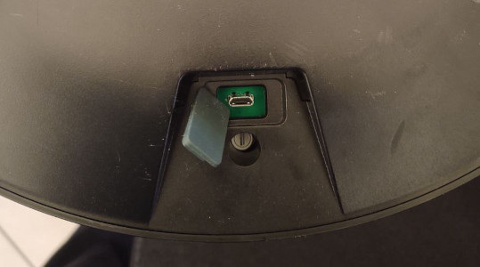

# Valetudo CRL-200S root

This repository contains tooling to help with rooting 3irobotix CRL-200S-based vacuum robots such as

* Viomi V2
* viomi.vacuum.v7
* Cecotec Conga 3290
* Proscenic M6 pro
* Wyze Robot Vacuum (WVCR200S)
* and more

Please refer to the docs on [Valetudo.cloud](https://valetudo.cloud) to find a full list of all supported models.

**Warning**:<br/>
Do **NOT** attempt to root the following robots as it **will brick** them.
- viomi.vacuum.v8 (check the SSID for v8 to identify it)
- Cecotec Conga 3090

## Prerequisites

* a linux machine with a working `adb` install
* a good micro-USB cable (with data support)

## Usage instructions

### 1. Find USB

Your robot has one or even two micro USB ports, which will be used for rooting.



If your robot has a second micro USB port in the back like in the image above please make sure to use that.


If however your robot looks like this then don't worry.
There is a second micro USB port in the battery compartment, which is easily accessible without destroying any warranty seals:


### 2. Check if ADB works

Now with the USB port located, turn on the robot and wait for it to boot up.

If you're only seeing the adb device show for a fraction of a second on boot and otherwise get `no devices found`, then step 3.1 is for you.
If you instead are already able to get a login shell using `adb shell` then go to 3.2.

### 3.1. Enable ADB access

Some robots (notably the Viomi V7) disable ADB access right after bootup.

To fix that, please download and run the `enable-adb.sh` found in the root directory of this repo.<br/>
After following its instructions, you should end up with a password-less rootshell via `adb shell`.

### 3.1.1 Enable ADB access on Wyze Robot Vacuum (WVCR200S)

To enable ADB, use the following procedure: 

```
1. Hold down home button
2. Plug in USB cable under battery
3. Press power button 10 times
```

Original Documentation here: https://github.com/rumpeltux/python-miio/issues/1#issuecomment-915647117
### 3.2. Change the root password

If running `adb shell` looks like this:
```
$ adb shell
TinaLinux login:
```

then simply create a file named `adb_shell` with these contents:

```
#!/bin/sh
export ENV='/etc/adb_profile'
exec /bin/sh "$@"
```

`chmod +x` that file and then `adb push ./adb_shell /bin/adb_shell`.

Now, running `adb shell` again should present you with a password-less rootshell.

### 4. Backups!

With a working ADB connection, now is the time to pull a backup of everything.<br/>
For that, simply run the following commands:

```
adb pull /proc/partitions

adb pull /dev/nanda
adb pull /dev/nandb
adb pull /dev/nandc
adb pull /dev/nandd
adb pull /dev/nande
adb pull /dev/nandf
adb pull /dev/nandg
adb pull /dev/nandh
adb pull /dev/nandi
```

If the partitions file contains even more nand partitions then also backup those!

### 5. Install Valetudo

First, head over to [the dustbuilder](https://builder.dontvacuum.me) and build a firmware package built for manual installation.<br/>
After downloading the `tar.gz` from the link in your email, simply push it to the robot like this:<br/>
`adb push ./<rooted_firmware_filename>.tar.gz /tmp/`

You will also need the latest Valetudo binary. Download it from here:<br/>
[https://github.com/Hypfer/Valetudo/releases/latest/download/valetudo-armv7.upx](https://github.com/Hypfer/Valetudo/releases/latest/download/valetudo-armv7.upx)

It is very important that the Valetudo binary is pushed to **the correct location** on the robot:<br/>
`adb push ./valetudo-armv7.upx /mnt/UDISK/valetudo`. 


With that done, the last required file is the convert-robot.sh script that can be found in ths repo:<br/>
`adb push ./convert-robot.sh /tmp/`

To finalize the rooting procedure, connect with `adb shell` and then run the following commands:
```
cd /tmp/
sh ./convert-robot.sh
tar xzvf ./<rooted_firmware_filename>.tar.gz
sh ./install.sh
```

If everything went well then your robot should now be running Valetudo.

### 6. Additional model-specific steps

If your robot happens to be Conga 3790, you will need to do one last thing.
**If you have a different robot, you must skip this step.**

Because that robot uses a different Wi-Fi module, we need to do some changes. Don't worry, they're all scripted.

Simply open a shell with `adb shell` and execute `/opt/8821cs/enable_8821cs.sh`.
Then, `reboot` and you're done

### 7. Start using Valetudo

To join your Robot to your Wi-Fi network and start using Valetudo, press and hold the two buttons until the robot informs you that Wi-Fi has been reset.<br/>
Then, continue with the [getting started guide](https://valetudo.cloud/pages/general/getting-started.html#joining_wifi).

## Credits

This tooling is based on knowledge and work by

- The initial Viomi research of @rumpeltux [Rooting the Xiaomi STYJ02YM (viomi-v7) Vacuum Robot](https://itooktheredpill.irgendwo.org/2020/rooting-xiaomi-vacuum-robot/)
- The [viomi-root](https://github.com/rumpeltux/viomi-rooting) repository by @rumpeltux and community
- Conga research by [the freeconga community](https://gitlab.com/freeconga/stuff/-/tree/master/docs)
